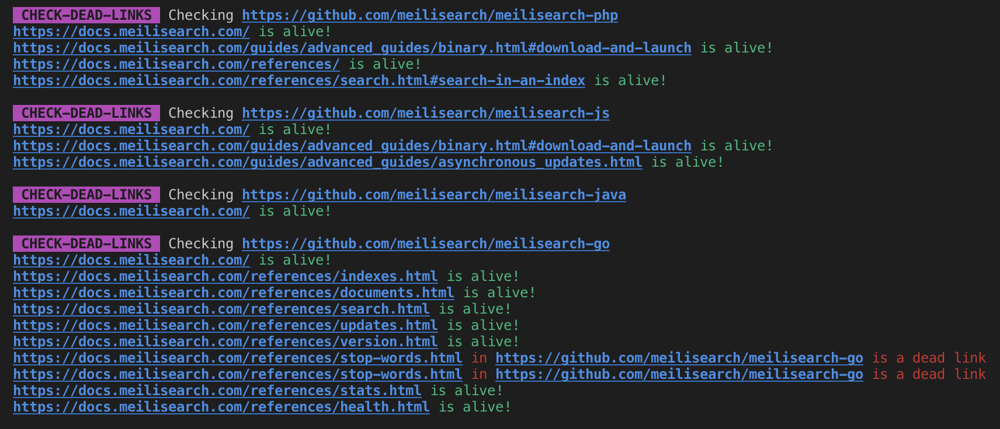

# vuepress-plugin-external-link-checks

Given a list of external links, this package will test if all the links found in those external pages that match the vuepress website's hostname are still alive.

You can run the test against your local vuepress routing using the (soon to come) vuepress plugin, or you can run the test against your online vuepress.

## Features



- Will check all the links to a given domain in the given url list:
    - Comparing it with locally generated links, when building your vuepress in development
    - Comparing it with your online documentation.

### Locally
When building your vuepress application a siteData file is generated which contains all the routes of your documentation.
After fetching all HTML from the given `urls` list, this package will retrieve all links with the given `hostname` in the different fetched HTMLs. The urls found will be searched in the siteData file. If not present a warning will be raised. This means your link does not exists in your new build.

### Online

Given that your documentation is already online and you would like to check if all the links to your documentation in the given `urls` list are still alive.
This package will fetch the HTML from all the `urls` given and retrieve all links pointing to the given `hostname`. It will ping all those links, if they do not result in a success a warning will be raised. This means the link is dead.

**The online mode `-o` has nothing to do with vuepress and should be moved to its own package.**

## Install

```bash
yarn add vuepress-plugin-external-link-checks
```

## Getting started

### Vuepress plugin
in `config.js`
```
plugins: [
    [ "external-link-checks" ,
        { hostname: "docs.myhostname.com", "urls": [
        "https://github.com/someGithub",
        "https://www.myhostnamelanding.com/",
        ]
    }]
]
```

You can also add a `.externallinkchecksrc` file at the root of your vuepress with the above configs.
You can also create your own file, and store it whever you want in the project and just add the link in config.js using `configFile: "path/to/my/file"`

### CLI

#### With a config file
Create a `.externallinkchecksrc` file
```
{
    hostname: "docs.myhostname.com",
    "urls": [
        "https://github.com/someGithub",
        "https://www.myhostnamelanding.com/",
    ]
}
```

```bash
$ vuepress-plugin-external-link-checks
```

#### With your custom config file

```bash
$ vuepress-plugin-external-link-checks -C myconfigfile.json
```

#### With CLI options

```bash
$ vuepress-plugin-external-link-checks -H docs.myhostname.com -u "https://github.com/someGithub,https://www.myhostnamelanding.com/"
```


## Try out


```bash
$ cd vuepress-plugin-external-link-checks
$ npm link
$ npx vuepress-plugin-external-link-checks -t test/vuepress -H docs.meilisearch.com
```
or
```bash
$ cd examples
$ npm link
$ ./docs.meilisearch.sh
```

### Options

| CLI option    | Config file option    | Type      |   Description | Default value |
| ---           | ---                   |      ---  |  ---          | ---           |
| -H, --hostname | hostname  | String | links pointing to this hostname should always work | none           |
| -u, --urls | urls  | String[] | list of external urls on which to find hostname links | []           |
| -C, --config-file | configFile  | String | Path to your config file  | ./.externallinkchecksrc           |
| -o, --online | online  | Boolean | Will check in online documentation if provided | not provided  |
| -s, --sitedata | siteData  | String | Path to the generated siteData.js file of vuepress used in local mode (--online not provided) | will check in multiple places  |

## Test
```
yarn test
```

## Style
```
yarn style
yarn style:fix
```

## TODO:

- publish on NPM
- add multilanguage links (/en/, /fr/)
- add a hash checker on online version
- stop process if a dead link was found
- Promisify online version
